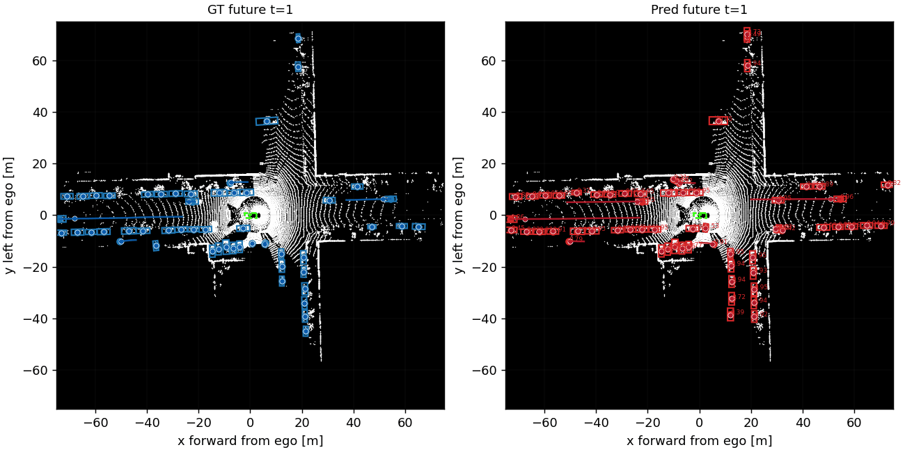
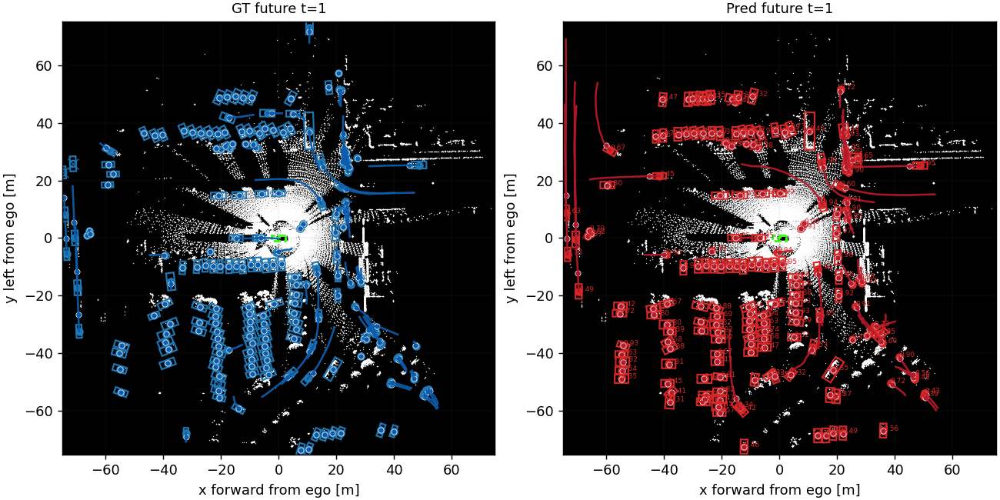
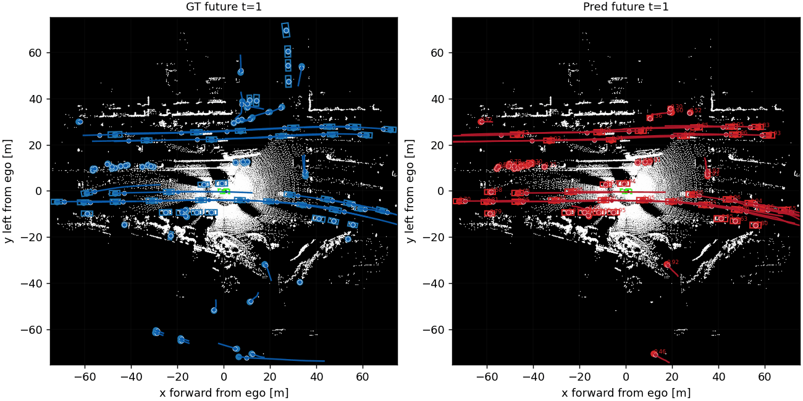
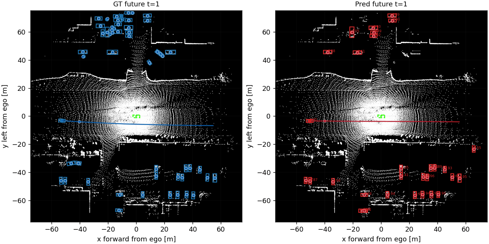

# MC-DeTra: Motion-Consistent Joint Detection and Trajectory Forecasting

A faithful, openly released reproduction of **DeTra** (joint LiDAR object detection and
trajectory forecasting on the Waymo Open Dataset) plus **MC-DeTra**: three *train-only,
inference-safe* motion-consistency auxiliaries and a gradient-norm loss-calibration
analysis. All auxiliaries shape the shared BEV representation during training and are
removed at inference, so the deployed model and its latency are identical to the base
reproduction.

- **PR - Past Reconstruction**: decode each actor's observed past from the refined query.
- **OA - Occupancy Auxiliary**: predict a BEV occupancy/flow field from the shared trunk.
- **HC - Heading Consistency**: align the detected box yaw with the predicted best-mode
  trajectory direction.

> This repository is anonymized for double-blind review.

## Qualitative results

MC-DeTra jointly detects vehicles and forecasts their future trajectories. Each clip
shows the LiDAR sweep with, on the left, ground-truth boxes and futures (blue) and, on
the right, the model's detections and best-mode forecasts (red); the ego vehicle is green
at the origin. Predictions are produced with the deployed base model (auxiliaries removed
at inference).

| Intersection turn | Crowded scene |
|:---:|:---:|
|  |  |
| **Multi-lane flow** | **Long-range forecasting** |
|  |  |

## Installation

```bash
python -m venv .venv && source .venv/bin/activate      # or conda
pip install -r requirements-lock.txt                   # pinned; use requirements.txt for loose pins
```

## Data

1. Download the [Waymo Open Dataset](https://waymo.com/open/) perception TFRecords.
2. Build the BEV cache used by the models (BEV over ROI `[-75, 75] m` at `0.1 m`,
   5-sweep LiDAR):

   ```bash
   PYTHONPATH=. python -m detra_repro.data.cache_v2 \
     --waymo-root /path/to/waymo_perception --out /path/to/waymo_cache
   ```
3. Point the configs at your cache: edit `train_cache` / `val_cache` in the config you
   run (they default to the placeholder `/path/to/waymo_cache/{train,val}`), or override
   on the CLI with `--train-cache` / `--val-cache`.

The train/val segment split we use is in `splits/waymo_train_val.json`.

## Reproducing the paper

Every configuration shares one initializer and an identical fine-tuning schedule, so
rows differ only by the enabled losses. Train the base once, then fine-tune each
mechanism from it.

```bash
# 1) Base DeTra reproduction (the single initializer -> checkpoints/base_reproduction.pt)
PYTHONPATH=. python -m detra_repro.train_cached --experiment-json configs/base_reproduction.json

# 2) Any mechanism (resumes weights-only from checkpoints/base_reproduction.pt)
PYTHONPATH=. python -m detra_repro.train_cached --experiment-json configs/mc_detra.json

# 3) Detection AP + strict, detection-conditioned forecasting eval
PYTHONPATH=. python -m detra_repro.evaluate_detection_pr \
  --experiment-json configs/mc_detra.json --checkpoint checkpoints/mc_detra.pt
PYTHONPATH=. python -m detra_repro.eval.dump_paper_forecasting \
  --checkpoint checkpoints/mc_detra.pt --cache /path/to/waymo_cache/val --out preds.npz
PYTHONPATH=. python -m detra_repro.eval.eval_forecasting --pred preds.npz
```

### Config -> paper row

| Config | Table 1/2 row | Loss weights (PR / OA / HC) |
|---|---|---|
| `base_reproduction.json` | DeTra* (initializer) | - |
| `finetune_no_aux.json` | Fine-tune, no auxiliaries | - |
| `pr_only.json` | PR only | 0.05 / - / - |
| `oa_only.json` | OA only | - / 0.20 / - |
| `hc_only.json` | HC only | - / - / 2.0 |
| `pr_oa.json` | PR+OA | 0.05 / 0.20 / - |
| `pr_oa_hc_0p20.json` | PR+OA+HC | 0.05 / 0.20 / 0.25 |
| **`mc_detra.json`** | **MC-DeTra (best)** | **0.05 / 0.30 / 0.25** |
| `controller_a.json` | PR+OA+HC (controller A) | dynamic (grad-norm) |
| `controller_b.json` | PR+OA+HC (controller B) | dynamic (grad-norm) |

## Inference latency

```bash
PYTHONPATH=. python tools/benchmark_inference_latency.py \
  --cache /path/to/waymo_cache/val --checkpoint checkpoints/base_reproduction.pt \
  --num-samples 30 --repeats 3 --num-queries 600 \
  --proposal-nms-mode rotated --proposal-nms-radius-m 0.1
```

## Repository layout

```
detra_repro/        core package (data, models, losses, training, eval)
configs/            training/eval configs (see table above)
tools/              latency benchmark, profiling, input/scenario visualizers
splits/             train/val segment split
assets/             qualitative result clips shown in this README
```

## Optional experiment logging

Comet is optional and disabled by default. To enable it, set `COMET_API_KEY` (env or a
local `.env`; see `.env.example`) and `"comet": true` plus your own
`comet_project` / `comet_workspace` in the config.

## License

MIT - see `LICENSE`.
